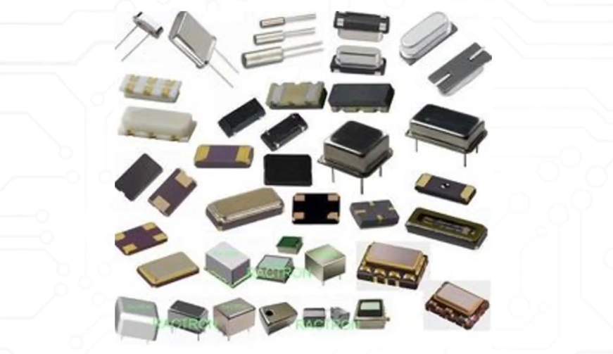

# 电子实物认识：

### 电子设计流程：

PCB 和 PCBA：

- PCB：
- PCBA：

### 电阻：

#### 电阻的定义：

#### 电阻的作用：

### 电阻的实物：

### 电容：

#### 电容的定义：

#### 电容的作用：

#### 电容的符号：

#### 电容的分类：

#### 电容的实物：

### 电感：

#### 电感的定义：

#### 电感的作用：

#### 电感的符号：

#### 电感的分类：

#### 电感的实物：

### 保险丝：

#### 保险丝的定义：

#### 保险丝的分类：

#### 保险丝的实物：

### 晶振：

#### 晶振的定义：

#### 晶振的实物：

### 二极管：

#### 二极管的定义：

#### 二极管的分类：

#### 二极管的符号：

#### 二极管的实物图：

### 三极管：

#### 三极管的定义：

#### 三极管的分类：

#### 三级管的工作原理：

### 场效应管:

#### 场效应管的定义：

### 集成IC：

#### 集成IC的定义：

#### 集成IC的分类：

#### 制造过程：

### 继电器：

#### 继电器的定义：

