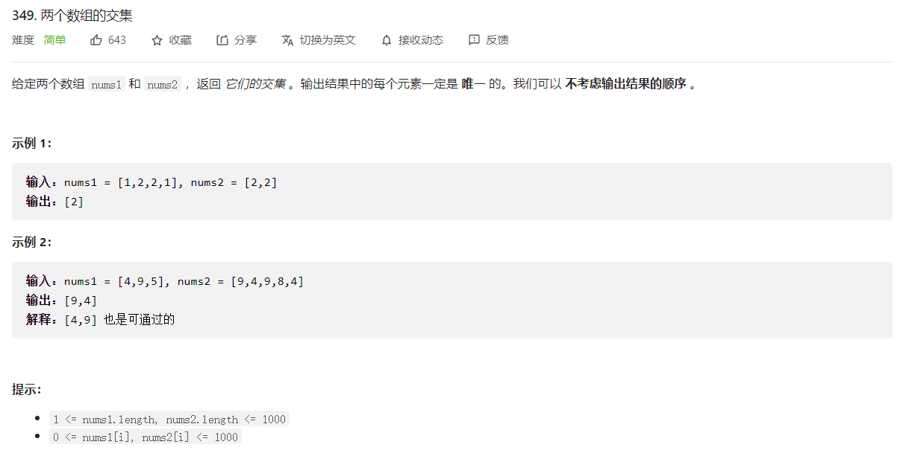
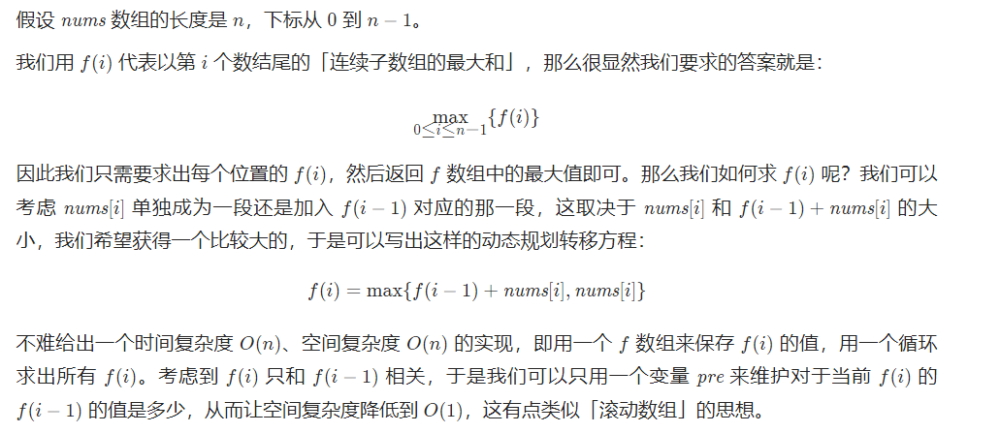
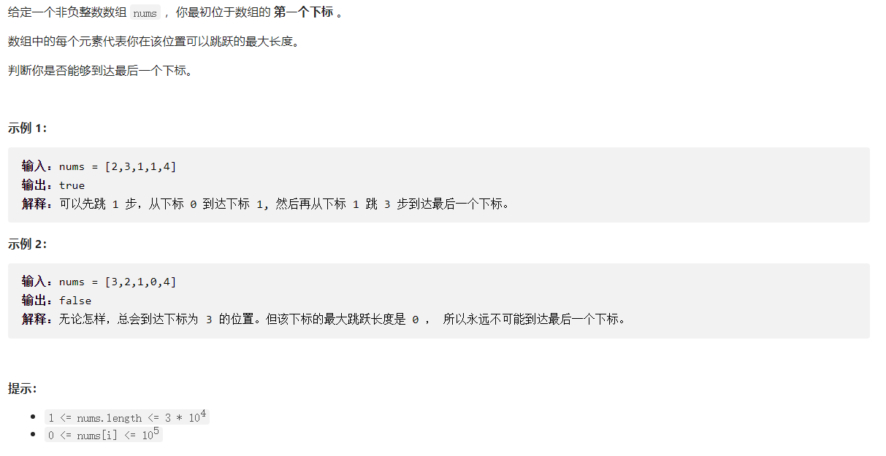
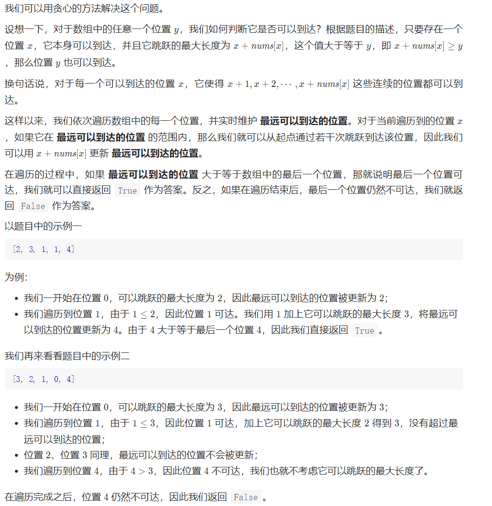

# 两个数组求交集：



### 解法一：两个集合

计算两个数组的交集，直观的方法是遍历数组 nums1，对于其中的每个元素，遍历数组 nums2 判断该元素是否在数组 nums2 中，如果存在，则将该元素添加到返回值。假设数组 nums1 和 nums2 的长度分别是 mm 和 nn，则遍历数组 nums1 需要 O(m)O(m) 的时间，判断 nums1 中的每个元素是否在数组 nums2 中需要 O(n)O(n) 的时间，因此总时间复杂度是 O(mn)O(mn)。

如果使用哈希集合存储元素，则可以在 O(1)O(1) 的时间内判断一个元素是否在集合中，从而降低时间复杂度。

首先使用两个集合分别存储两个数组中的元素，然后遍历较小的集合，判断其中的每个元素是否在另一个集合中，如果元素也在另一个集合中，则将该元素添加到返回值。该方法的时间复杂度可以降低到 O(m+n)O(m+n)

```java
class Solution {
    public int[] intersection(int[] nums1, int[] nums2) {
        Set<Integer> set1 = new HashSet<Integer>();
        Set<Integer> set2 = new HashSet<Integer>();
        for (int num : nums1) {
            set1.add(num);
        }
        for (int num : nums2) {
            set2.add(num);
        }
        return getIntersection(set1, set2);
    }

    // 判断元素重复：
    public int[] getIntersection(Set<Integer> set1, Set<Integer> set2) {
        // 提高执行效率：
        if (set1.size() > set2.size()) {
            return getIntersection(set2, set1);
        }
        Set<Integer> intersectionSet = new HashSet<Integer>();
        for (int num : set1) {
            if (set2.contains(num)) {
                intersectionSet.add(num);
            }
        }
        int[] intersection = new int[intersectionSet.size()];
        int index = 0;
        for (int num : intersectionSet) {
            intersection[index++] = num;
        }
        return intersection;
    }
}
```

#### 流式操作：

```java
class Solution {
    public int[] intersection(int[] nums1, int[] nums2) {
        Set<Integer> set = Arrays.stream(nums1).boxed().collect(Collectors.toSet());
        return Arrays.stream(nums2).distinct().filter(set::contains).toArray();
    }
}

```

### 解法二：排序 + 双指针

如果两个数组是有序的，则可以使用双指针的方法得到两个数组的交集。

首先对两个数组进行排序，然后使用两个指针遍历两个数组。可以预见的是加入答案的数组的元素一定是递增的，为了保证加入元素的唯一性，我们需要额外记录变量 \textit{pre}pre 表示上一次加入答案数组的元素。

初始时，两个指针分别指向两个数组的头部。每次比较两个指针指向的两个数组中的数字，如果两个数字不相等，则将指向较小数字的指针右移一位，如果两个数字相等，且该数字不等于 \textit{pre}pre ，将该数字添加到答案并更新 \textit{pre}pre 变量，同时将两个指针都右移一位。当至少有一个指针超出数组范围时，遍历结束。

```java
class Solution {
    public int[] intersection(int[] nums1, int[] nums2) {
        Arrays.sort(nums1);
        Arrays.sort(nums2);
        int length1 = nums1.length, length2 = nums2.length;
        int[] intersection = new int[length1 + length2];
        int index = 0, index1 = 0, index2 = 0;
        while (index1 < length1 && index2 < length2) {
            int num1 = nums1[index1], num2 = nums2[index2];
            if (num1 == num2) {
                // 保证加入元素的唯一性
                if (index == 0 || num1 != intersection[index - 1]) {
                    intersection[index++] = num1;
                }
                index1++;
                index2++;
            } else if (num1 < num2) {
                index1++;
            } else {
                index2++;
            }
        }
        return Arrays.copyOfRange(intersection, 0, index);
    }
}
```

<hr>

# 最大子序和:

### 动态规划；



这里maxAns必须赋值为第一个元素，不能赋值为0，因为第一个元素可能为负数！

```java
class Solution {
    public int maxSubArray(int[] nums) {
        int pre = 0;
        int maxAns = nums[0];
        
        for (int x : nums) {
            pre = Math.max(pre + x, x);
            maxAns = Math.max(maxAns, pre);
        }
        return maxAns;
    }
}
```

<hr>

# 跳跃游戏:





```java
class Solution {
    public static boolean canJump(int[] nums) {
        int mostStep = 0;
        boolean flag = false;

        for (int i = 0; i < nums.length; i++){
            if (i <= mostStep) {
                mostStep = Math.max(mostStep, i + nums[i]);
                if (mostStep >= nums.length - 1){
                    flag = true;
                }
            }
        }

        return flag;
    }
}
```

