## 冯诺依曼计算机特点:

- 计算机由五大部件组成：计算器、控制器、存储器、输入设备、输出设备
- 指令和数据是以同等地位存储在存储器中，可以按照地址进行寻访
- 指令和数据是以二进制进行保存
- 指令是由操作码和地址码组成
- 存储程序
- 以运算器为中心

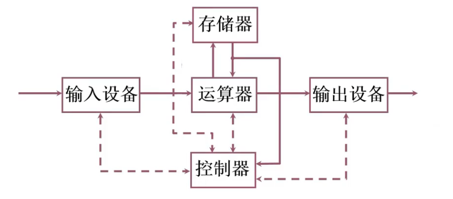

- 运算器：算数运算、逻辑运算
- 存储器：存放数据和程序
- 控制器：执行控制程序的运行，完成指令之间的调度
- 输入设备：将输入的信息转换为机器能够识别的形式
- 输出设备：将运算器的输出结果转换成人们熟悉的形式

### 改进为以存储器为核心的计算机：

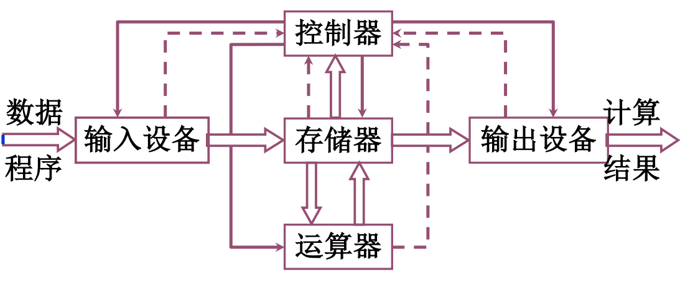

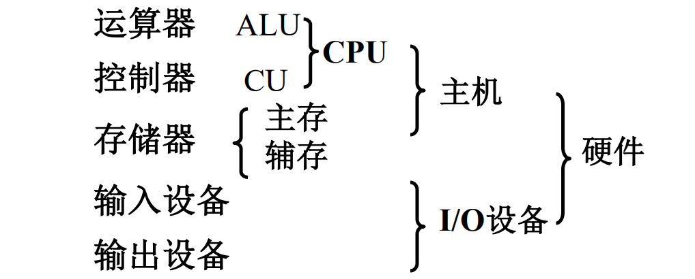

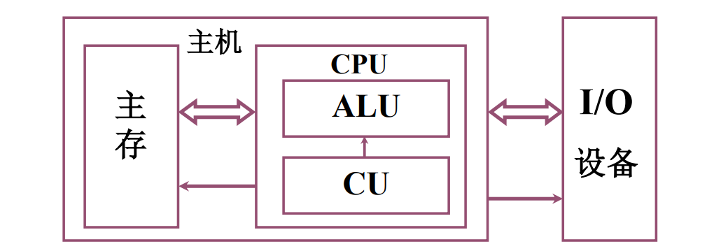

### 系统复杂性管理的方法：

- 层次化（Hierachy）：将被设计的系统划分为多个模块或者子模块
- 模块化（Modularity）：有明确定义（Well-defined）的功能和接口
- 规则性（Regularity）：模块更容易被复用

## 存储器的基本组成：

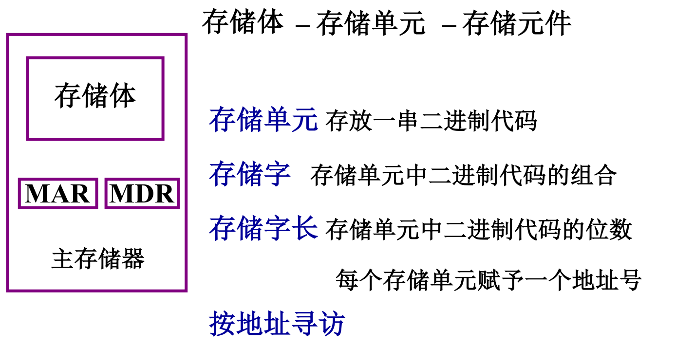

- MAR：存储器地址寄存器，反映了存储单元的个数
- MDR：存储器数据寄存器，反映了存储字长

## 运算器的基本组成：

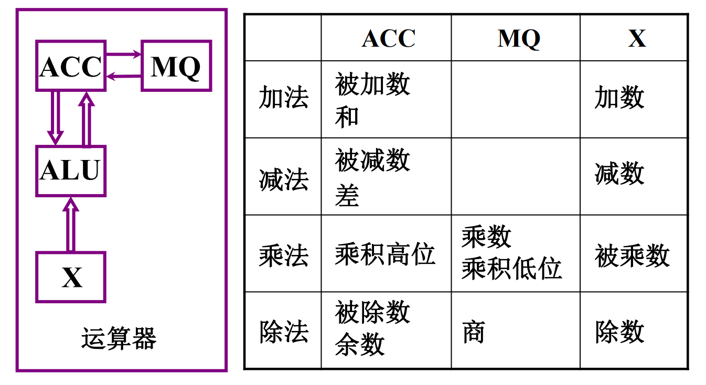

### 1.加法过程：

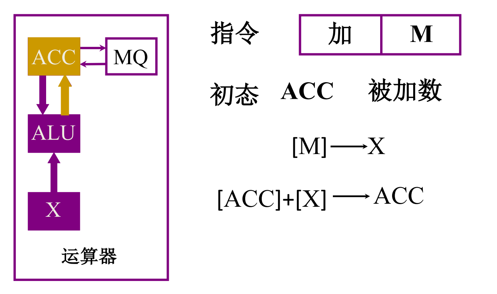

### 2.减法操作：

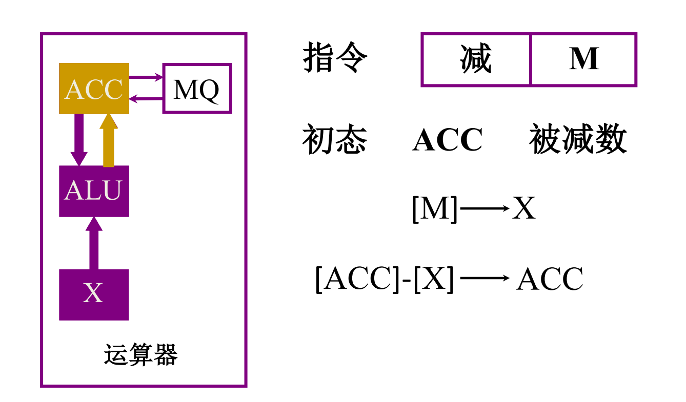

### 3.乘法操作：

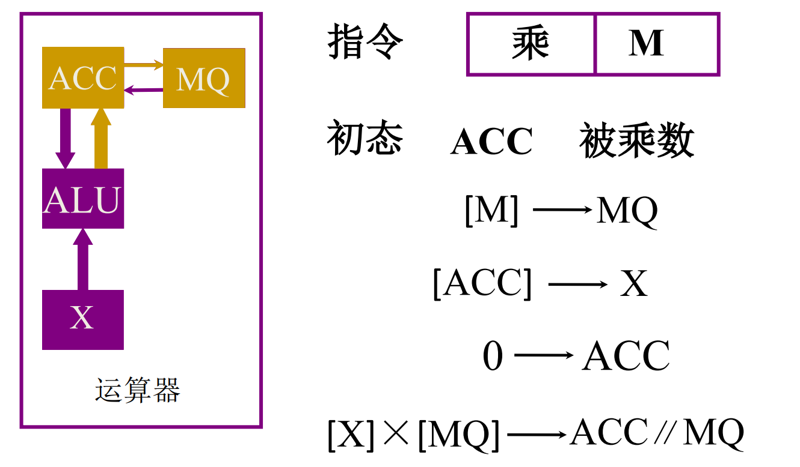

### 4.除法操作：

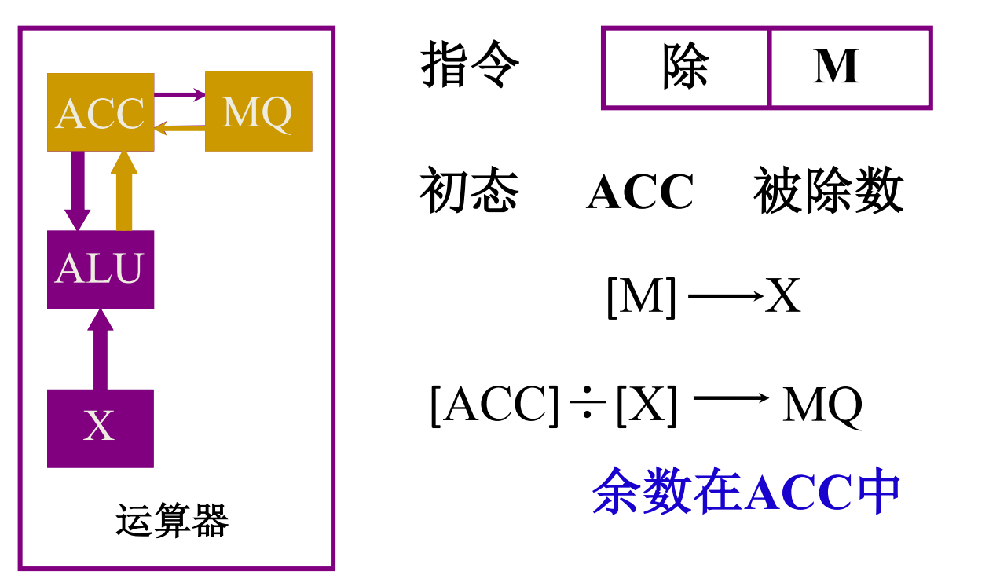

## 控制器的基本组成：

控制器：解释指令，保证指令按顺序执行。

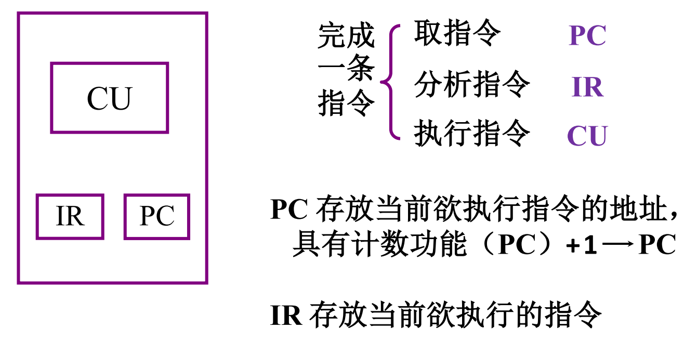

- PC：程序计数器，指定将要执行的下一条指令在存储器中的地址。
- IR：存放即将执行的指令。

存储器、运算器、控制器 组成了计算机的主机。

### 主机完成一条指令的过程：

以取数为例：

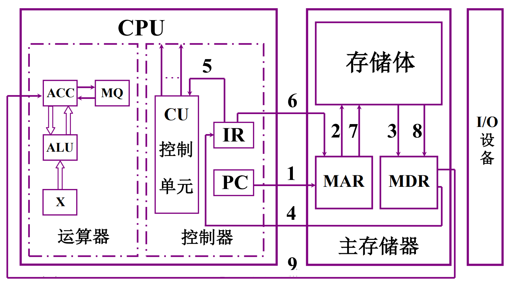

以存数为例：

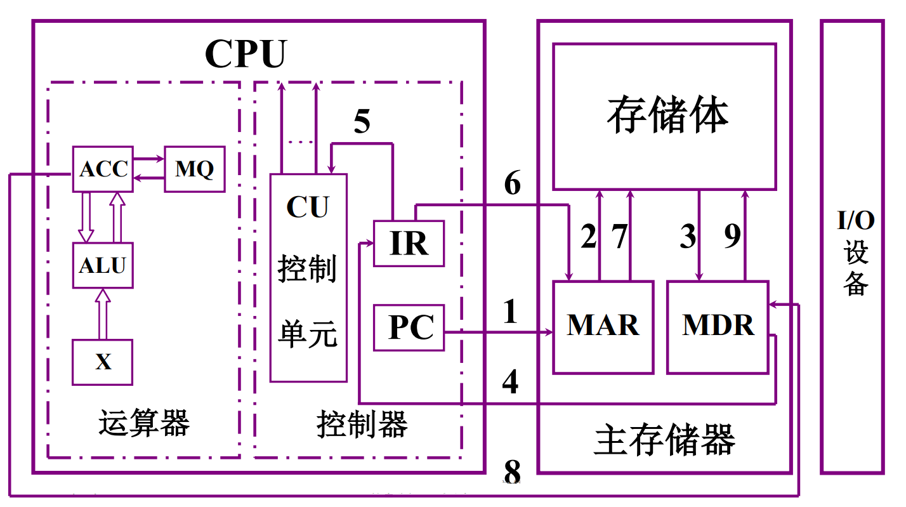

> <b>试对比分析冯诺依曼结构和哈佛结构:</b>  
> &emsp;&emsp;冯诺依曼结构是数据和指令都存储在相同的存储器中，某存储单元中要么存储的是指令，要么存储的是数据；哈弗结构是数据和指令分别存储在不同的存储体中，数据存储体中只能存数据，指令存储体中只能存指令；从执行速度上哈弗结构的速度要更快一些，但是相对硬件也相对复杂一些。