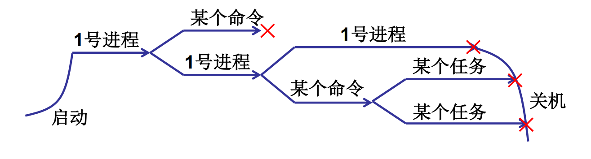

# 进程与线程

## CPU管理的直观想法：

### CPU的工作原理：

**取值执行**

多道程序，交替执行！一个CPU上交替执行多个程序：并发

PCB：存放信息的结构（程序运行时状态）

进程是程序的运行时状态

### 进程 概念：


<hr/>

## 多进程图像：

多进程图像从启动到关机结束！

```c
if(!fork()) { init(); }
```

- `init`中执行了`shell(Windows桌面)`

- `shell`中再启动其他进程



### 多进程如何组织？

&emsp;&emsp;操作系统通过PCB感知进程。PCB（Process Control Block）：用来记录进程信息的数据结构。


