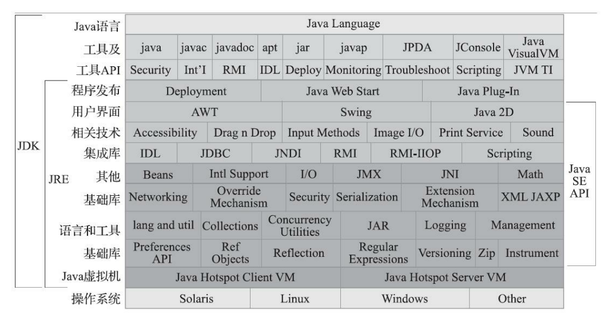
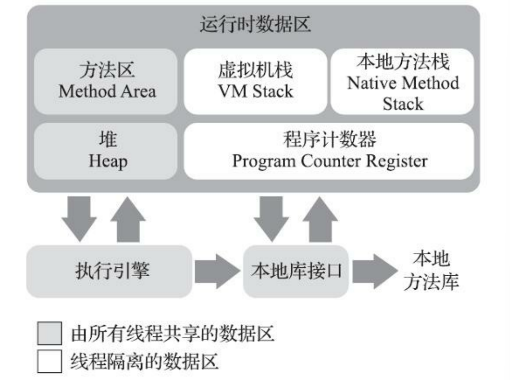
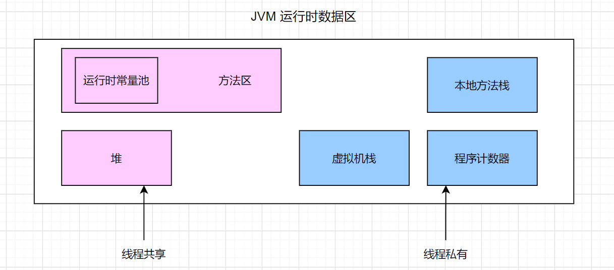

# 《深入理解Java虚拟机》阅读笔记

## 第一部分：走进 Java：

### Java 优越性：

- 摆脱了硬件平台的束缚，实现了“一次编写，到处运行”
- 提供了一种相对安全的内存管理和访问机制，避免了绝大部分内存泄漏和指针越界问题
- 实现了热点代码检测和运行时编译及优化

### Java 技术体系：

**JDK（Java Development Kit） 组成部分：**

- Java程序设计语言
- Java虚拟机
- Java类库

> ​	把Java类库API中的**Java SE API子集**和**Java虚拟机**这两部分统称为 JRE（Java Runtime Environment），JRE是支持Java程序运行的标准环境。

**Java技术体系所包括的内容：**

## 第二部分 自动内存管理：

### 1.Java内存区域与内存溢出异常：

#### 运行时数据区域：

&emsp;&emsp;**Java虚拟机在执行Java程序的过程中会把它所管理的内存划分为若干个不同的数据区域。**这些区域 有各自的用途，以及创建和销毁的时间，有的区域随着虚拟机进程的启动而一直存在，有些区域则是 依赖用户线程的启动和结束而建立和销毁。

##### 程序计数器：

&emsp;&emsp;程序计数器（Program Counter Register）是一块较小的内存空间，它可以看作是当前线程所执行的 字节码的行号指示器。

> 类似操作系统的CS/IP寄存器，指示下一条将要执行的指令。

&emsp;&emsp;在Java虚拟机的概念模型里，字节码解释器工作时就是通过改变这个计数器 的值来选取下一条需要执行的字节码指令，它是程序控制流的指示器，分支、循环、跳转、异常处 理、线程恢复等基础功能都需要依赖这个计数器来完成。

&emsp;&emsp;Java虚拟机的多线程是通过线程轮流切换、分配处理器执行时间的方式来实现的，在任何一 个确定的时刻，一个处理器（对于多核处理器来说是一个内核）都只会执行一条线程中的指令。因 此，为了线程切换后能恢复到正确的执行位置，每条线程都需要有一个独立的程序计数器，各条线程 之间计数器互不影响，独立存储，我们称这类内存区域为**“线程私有”的内存**。

&emsp;&emsp;如果线程正在执行的是一个Java方法，这个计数器记录的是正在执行的**虚拟机字节码指令的地址**；**如果正在执行的是本地（Native）方法，这个计数器值则应为空（Undefined）**。

> 为什么在执行本地方法（Native Method）是，JVM的程序计数器会是Undefined？这样如何能保证本地方法执行完成之后能够返回的程序执行位置？
>
> - 在程序计数器的定义中，**程序计数器存放的是Java字节码的地址（虚拟机字节码指令），而native方法的方法体是非JVM规范语言，没有字节码，所以程序计数器的值才未定义。**
> - 每个**Java线程都直接映射到一个OS线程上执行**。所以**native方法就在本地线程上执行**，无需理会JVM规范中的程序计数器的概念。仔细看一下JVM规范，如果一个线程执行Native方法，程序计数器的值未定义，可不是一定为空，任何值都可以。native方法执行后会退出(栈帧pop)，方法退出返回到被调用的地方继续执行程序。

##### 虚拟机栈：

&emsp;&emsp;**Java虚拟机栈（Java Virtual Machine Stack）是线程私有的**，它的生命周期与线程相同。虚拟机栈描述的是Java方法执行的线程内存模型：每个方法被执行的时候，Java虚拟机都会同步创建一个**栈帧（Stack Frame）用于存储局部变量表、操作数栈、动态连接、方法出口等信息**。每一个方法被调用直至执行完毕的过程，就对应着一个栈帧在虚拟机栈中从入栈到出栈的过程。

&emsp;&emsp;局部变量表存放了编译期可知的各种Java虚拟机基本数据类型（boolean、byte、char、short、int、 float、long、double）、对象引用（reference类型，它并不等同于对象本身，可能是一个指向对象起始 地址的引用指针，也可能是指向一个代表对象的句柄或者其他与此对象相关的位置）和returnAddress 类型（指向了一条字节码指令的地址）。

&emsp;&emsp;**这些数据类型在局部变量表中的存储空间以局部变量槽（Slot）来表示**，其中64位长度的long和 double类型的数据会占用两个变量槽，其余的数据类型只占用一个。局部变量表所需的内存空间在编译期间完成分配，当进入一个方法时，这个方法需要在栈帧中分配多大的局部变量空间是完全确定的，在方法运行期间不会改变局部变量表的大小。请读者注意，这里说的“大小”是指变量槽的数量， 虚拟机真正使用多大的内存空间（譬如按照1个变量槽占用32个比特、64个比特，或者更多）来实现一 个变量槽，这是完全由具体的虚拟机实现自行决定的事情。

&emsp;&emsp;在《Java虚拟机规范》中，对这个内存区域规定了两类异常状况：如果**线程请求的栈深度大于虚拟机所允许的深度，将抛出StackOverflowError异常**；如果**Java虚拟机栈容量可以动态扩展，当栈扩 展时无法申请到足够的内存会抛出OutOfMemoryError异常**。

> &emsp;&emsp;**HotSpot虚拟机的栈容量是不可以动态扩展的**，以前的Classic虚拟机倒是可以。所以在HotSpot虚拟机上是不会由于虚拟机栈无法扩展而导致OutOfMemoryError异常——只要线程申请栈空间成功了就不会有OOM，但是如果申请时就失败，仍然是会出现OOM异常的

##### 本地方法栈：

&emsp;&emsp;本地方法栈（Native Method Stacks）与虚拟机栈所发挥的作用是非常相似的，其区别只是虚拟机 栈为虚拟机执行Java方法（也就是字节码）服务，而**本地方法栈则是为虚拟机使用到的本地（Native） 方法服务**。

##### 堆：

&emsp;&emsp;Java堆（Java Heap）是虚拟机所管理的内存中最大的一块。Java堆是被所有线程共享的一块内存区域，在虚拟机启动时创建。此内存区域的唯一目的就是存放对象实例，Java 世界里“几乎”所有的对象实例都在这里分配内存。

&emsp;&emsp;Java堆是垃圾收集器管理的内存区域，因此一些资料中它也被称作“GC堆”（Garbage Collected Heap）

##### 方法区：

&emsp;&emsp;方法区（Method Area）与Java堆一样，是各个线程共享的内存区域，它用于存储已被虚拟机加载 的类型信息、常量、静态变量、即时编译器编译后的代码缓存等数据。

&emsp;&emsp;**运行时常量池：**

&emsp;&emsp;**运行时常量池（Runtime Constant Pool）是方法区的一部分**。Class文件中除了有类的版本、字 段、方法、接口等描述信息外，还有一项信息是常量池表（Constant Pool Table），**用于存放编译期生 成的各种字面量与符号引用，这部分内容将在类加载后存放到方法区的运行时常量池中**。

#### 对象创建：

1. 当JVM遇到一条字节码new指令时，会去检查这个指令参数是否能够在常量池中定位到一个类的符号引用，并且检查这个符号引用代表的类是否已被加载、解析和初始化过。如果没有，那 必须先执行相应的**类加载过程**。
2. 在类加载检查通过后，接下来虚拟机将为新生对象分配内存。对象所需内存的大小在类加载完成 后便可完全确定，为对象分配空间的任务实际上便等同于把一块确定 大小的内存块从Java堆中划分出来。

> 假设Java堆中内存是绝对规整的，所有被使用过的内存都被放在一 边，空闲的内存被放在另一边，中间放着一个指针作为分界点的指示器，那所分配内存就仅仅是把那 个指针向空闲空间方向挪动一段与对象大小相等的距离，这种分配方式称为“指针碰撞”（Bump The Pointer）。
>
> 但如果Java堆中的内存并不是规整的，已被使用的内存和空闲的内存相互交错在一起，那 就没有办法简单地进行指针碰撞了，虚拟机就必须维护一个列表，记录上哪些内存块是可用的，在分 配的时候从列表中找到一块足够大的空间划分给对象实例，并更新列表上的记录，这种分配方式称 为“空闲列表”（Free List）。
>
> 选择哪种分配方式由Java堆是否规整决定，而Java堆是否规整又由所采用 的垃圾收集器是否带有空间压缩整理（Compact）的能力决定。因此，当使用Serial、ParNew等带压缩 整理过程的收集器时，系统采用的分配算法是指针碰撞，既简单又高效；而当使用CMS这种基于清除 （Sweep）算法的收集器时，理论上就只能采用较为复杂的空闲列表来分配内存。

3. Java虚拟机还要对对象进行必要的设置

> 例如这个对象是哪个类的实例、如何才能找到 类的元数据信息、对象的哈希码（实际上对象的哈希码会延后到真正调用Object::hashCode()方法时才 计算）、对象的GC分代年龄等信息。这些信息存放在对象的对象头（Object Header）之中。根据虚拟 机当前运行状态的不同，如是否启用偏向锁等，对象头会有不同的设置方式。

4. 从虚拟机的视角来看，一个新的对象已经产生了。但是从Java程序的视 角看来，对象创建才刚刚开始——构造函数，即Class文件中的()方法还没有执行，所有的字段都 为默认的零值，对象需要的其他资源和状态信息也还没有按照预定的意图构造好。一般来说（由字节 码流中new指令后面是否跟随invokespecial指令所决定，Java编译器会在遇到new关键字的地方同时生成 这两条字节码指令，但如果直接通过其他方式产生的则不一定如此），new指令之后会接着执行 ()方法，按照程序员的意愿对对象进行初始化，这样一个真正可用的对象才算完全被构造出来。

### 2.垃圾收集器与内存分配策略：

