# Lua基础语法

## 一、Lua 基础认识：

> Lua的脚本文件后最为`.lua`

### 1.注释：

- 单行注释：`--`
- 多行注释：`--[[ 多行注释 多行注释 --]]`

### 2.标识符：

&emsp;&emsp;Lua 标示符用于定义一个变量，函数获取其他用户定义的项。标示符以一个字母 A 到 Z 或 a 到 z 或下划线 _
开头后加上0个或多个字母，下划线，数字（0到9）。

### 3.关键字：

&emsp;&emsp;以下列出了 Lua 的保留关键字。保留关键字不能作为常量或变量或其他用户自定义标示符：

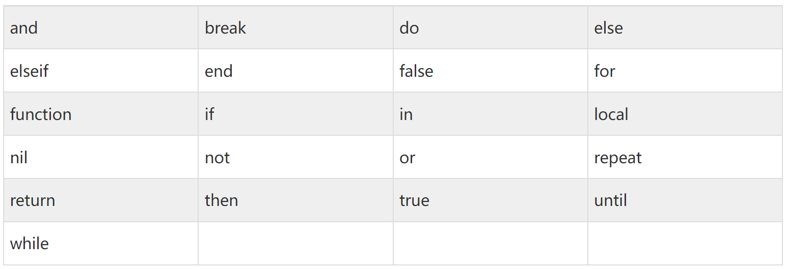

&emsp;&emsp;一般约定，以下划线开头连接一串大写字母的名字（比如 _VERSION）被保留用于 Lua 内部全局变量。

### 4.全局变量：

&emsp;&emsp;**在默认情况下，变量总是认为是全局的。**

&emsp;&emsp;全局变量不需要声明，给一个变量赋值后即创建了这个全局变量，访问一个没有初始化的全局变量也不会出错，只不过得到的结果是：nil。

```lua
b = nil
print(b)      --> nil
```

&emsp;&emsp;如果你想删除一个全局变量，只需要将变量赋值为nil。

<hr/>

## 二、Lua 数据结构：

> Lua是动态类型语言，变量不要类型定义,只需要为变量赋值。 值可以存储在变量中，作为参数传递或结果返回。

Lua中有8个基本类型分别为：nil、boolean、number、string、userdata、function、thread和table

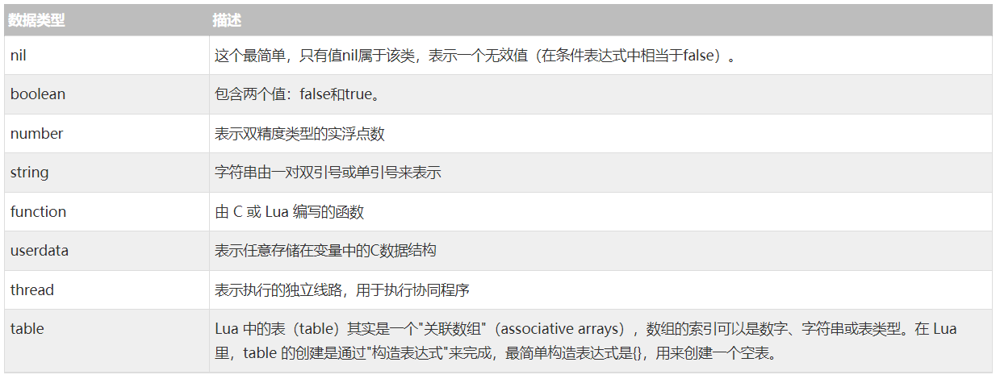

我们可以使用type函数测试给定变量或者值的类型:

```lua
print(type("Hello world"))      --> string
print(type(10.4 * 3))             --> number
print(type(print))              --> function
print(type(type))               --> function
print(type(true))               --> boolean
print(type(nil))                --> nil
print(type(type(X)))            --> string
```

### 1.nil（空 Null）:

nil 类型表示一种没有任何有效值，它只有一个值 -- nil，例如打印一个没有赋值的变量，便会输出一个 nil 值。

对于全局变量和 table，nil 还有一个"删除"作用，给全局变量或者 table 表里的变量赋一个 nil 值，等同于把它们删掉

```lua
tab1 = { key1 = "val1", key2 = "val2", "val3" }
for k, v in pairs(tab1) do
    print(k .. " - " .. v)
end

tab1.key1 = nil
for k, v in pairs(tab1) do
    print(k .. " - " .. v)
end
```

使用 nil 作比较时应该加上双引号：

```lua
> type(X)
nil
> type(X)==nil
false
> type(X)=="nil"
true
>
```

### 2.boolean 布尔类型：

boolean 类型只有两个可选值：true（真） 和 false（假），Lua 把 false 和 nil 看作是"假"，其他的都为"真":

```lua
print(type(true))
print(type(false))
print(type(nil))

if false or nil then
    print("至少有一个是 true")
else
    print("false 和 nil 都为 false")
end

if 0 then
    print("数字 0 是 true")
else
    print("数字 0 为 false")
end
```

### 3.number 数字类型：

Lua 默认只有一种 number 类型 -- double（双精度）类型（默认类型可以修改 luaconf.h 里的定义），以下几种写法都被看作是 number
类型：

```lua
print(type(2))
print(type(2.2))
print(type(0.2))
print(type(2e+1))
print(type(0.2e-1))
print(type(7.8263692594256e-06))
```

### 4.string 字符串：

字符串由一对双引号或单引号来表示。

```lua
string1 = "this is string1"
string2 = 'this is string2'
```

也可以用 2 个方括号 "[[]]" 来表示"一块"字符串。

```lua
html = [[
<html>
<head></head>
<body>
    <a href="//www.csbox.com/">CSBOX</a>
</body>
</html>
]]
print(html)
```

字符串连接使用的是 ..

```lua
> print("a" .. 'b')
ab
> print(157 .. 428)
157428
> 
```

使用 # 来计算字符串的长度，放在字符串前面，如下实例：

```lua
> len = "www.w3cschool.cn"
> print(#len)
16
> print(#"www.csbox.com")
13
> 
```

### 5.table 表：

在 Lua 里，table 的创建是通过"构造表达式"来完成，最简单构造表达式是{}，用来创建一个空表。也可以在表里添加一些数据，直接初始化表:

```lua
-- 创建一个空的 table
local tbl1 = {}
 
-- 直接初始表
local tbl2 = {"apple", "pear", "orange", "grape"}
```

Lua 中的表（table）其实是一个"关联数组"（associative arrays），数组的索引可以是数字或者是字符串。

```lua
-- 声明一个空的table：
a = {}
-- 给table进行赋值，索引+值
a["key"] = "value"

key = 10
a[key] = 22
a[key] = a[key] + 11

-- for循环：
for k, v in pairs(a) do
    print(k .. " : " .. v)
end
```

不同于其他语言的数组把 0 作为数组的初始索引，在 **Lua 里表的默认初始索引一般以 1 开始**。

```lua
local tbl = {"apple", "pear", "orange", "grape"}
for key, val in pairs(tbl) do
    print("Key", key)
end
```

table 不会固定长度大小，有新数据添加时 table 长度会自动增长，没初始的 table 都是 nil。

```lua
a3 = {}
for i = 1, 10 do
    a3[i] = i
end
a3["key"] = "val"
print(a3["key"])
print(a3["none"])
```

### 6.function 函数：

在 Lua 中，函数是被看作是"第一类值（First-Class Value）"，函数可以存在变量里:

```lua
function factorial1(n)
    if n == 0 then
        return 1
    else
        return n * factorial1(n - 1)
    end
end

print(factorial1(5))
factorial2 = factorial1
print(factorial2(5))
```

function 可以以匿名函数（anonymous function）的方式通过参数传递:

```lua
function anonymous(tab, fun)
    for k, v in pairs(tab) do
        print(fun(k, v))
    end
end
tab = { key1 = "val1", key2 = "val2" }
anonymous(tab, function(key, val)
    return key .. " = " .. val
end)
```

### 7.thread（线程）:

在 Lua 里，最主要的线程是协同程序（coroutine）。它跟线程（thread）差不多，拥有自己独立的栈、局部变量和指令指针，可以跟其他协同程序共享全局变量和其他大部分东西。

线程跟协程的区别：线程可以同时多个运行，而协程任意时刻只能运行一个，并且处于运行状态的协程只有被挂起（suspend）时才会暂停。

### 8.userdata（自定义类型）:

userdata 是一种用户自定义数据，用于表示一种由应用程序或 C/C++ 语言库所创建的类型，可以将任意 C/C++ 的任意数据类型的数据（通常是 struct 和 指针）存储到 Lua 变量中调用。

<hr/>

## 三、Lua 变量：

变量在使用前，必须在代码中进行声明，即创建该变量。编译程序执行代码之前编译器需要知道如何给语句变量开辟存储区，用于存储变量的值。

Lua 变量有三种类型：**全局变量、局部变量、表中的域**。

Lua 中的变量全是全局变量，那怕是语句块或是函数里，除非用 local 显式声明为局部变量。

局部变量的作用域为从声明位置开始到所在语句块结束。

Lua 中的变量全是全局变量，那怕是语句块或是函数里，除非用 local 显式声明为局部变量。

局部变量的作用域为从声明位置开始到所在语句块结束。

```text
a = 5               -- 全局变量
local b = 5         -- 局部变量

function joke()
    c = 5           -- 全局变量
    local d = 6     -- 局部变量
end

joke()
print(c,d)          --> 5 nil

do 
    local a = 6     -- 局部变量
    b = 6           -- 全局变量
    print(a,b);     --> 6 6
end

print(a,b)      --> 5 6
```

### 赋值语句：

Lua可以对多个变量同时赋值，变量列表和值列表的各个元素用逗号分开，赋值语句右边的值会依次赋给左边的变量。

```lua
a, b = 10, 2*x       <-->       a=10; b=2*x
```

<hr>

## 四、Lua 循环：

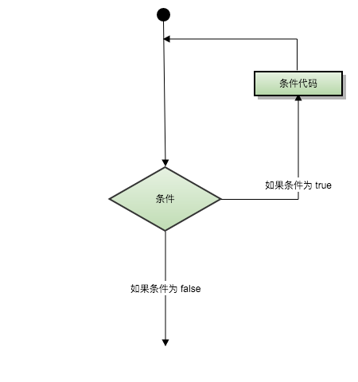

### Lua 循环方式：

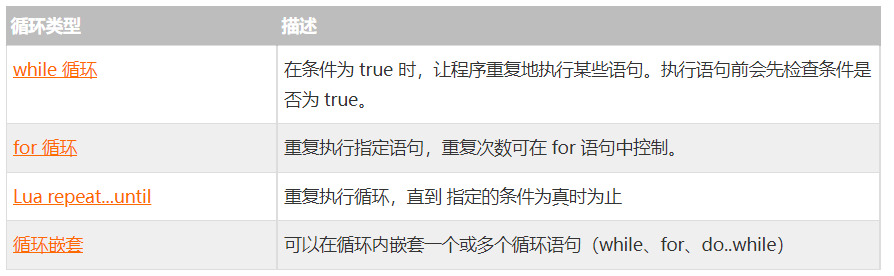

#### While 循环：

Lua 编程语言中 while 循环语句在判断条件为 true 时会重复执行循环体语句。

```lua
while(condition)
do
   statements
end
```

- **statements(循环体语句)** 可以是一条或多条语句，

- **condition(条件)** 可以是任意表达式，

- **condition(条件)** 为 true 时执行循环体语句。

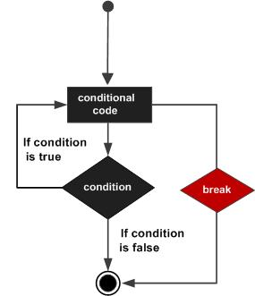

在以上流程图中我们可以看出在**condition(条件)**为 false 时会跳过当前循环并开始脚本执行紧接着的语句。

注：该循环结构又被称之为当型循环，可以理解为

```lua
a=10
while( a < 20 )
do
   print("a 的值为:", a)
   a = a+1
end
```

#### for 循环：

Lua 编程语言中数值for循环语法格式:

```lua
for var=exp1,exp2,exp3 do  
    <执行体>  
end 
```

var从exp1变化到exp2，每次变化以exp3为步长递增var，并执行一次"执行体"。exp3是可选的，如果不指定，默认为1。

```lua
for i=1,f(x) do
    print(i)
end
 
for i=10,1,-1 do
    print(i)
end
```

for的三个表达式在循环开始前一次性求值，以后不再进行求值。比如上面的f(x)只会在循环开始前执行一次，其结果用在后面的循环中。

#### 泛型for循环：

泛型for循环通过一个迭代器函数来遍历所有值，类似java中的foreach语句。

Lua 编程语言中泛型for循环语法格式:

```lua
--打印数组a的所有值  
for i,v in ipairs(a) 
	do print(v) 
end  
```

i是数组索引值，v是对应索引的数组元素值。ipairs是Lua提供的一个迭代器函数，用来迭代数组。

#### repeat…until 循环:

Lua 编程语言中 repeat...until 循环语句不同于 for 和 while循环，for 和 while循环的条件语句在当前循环执行开始时判断，而 repeat...until 循环的条件语句在当前循环结束后判断。

Lua 编程语言中 repeat...until 循环语法格式:

```lua
repeat
   statements
until( condition )
```

repeat...until 是条件后行,所以repeat...until 的循环体里面至少要运行一次。

- **statements(循环体语句)** 可以是一条或多条语句
- **condition(条件)** 可以是任意表达式，
- **condition(条件)** 为 false 时执行循环体语句。

在**condition(条件)**为 true 时会跳过当前循环并开始脚本执行紧接着的语句。


> 注：该循环结构又被称为直到型循环，可以简单的理解为：直到condition为真才跳出循环

```lua
--[ 变量定义 --]
a = 10
--[ 执行循环 --]
repeat
   print("a的值为:", a)
   a = a + 1
until( a > 15 )
```

#### Break 语句：

Lua 编程语言 break 语句插入在循环体中，用于退出当前循环或语句，并开始脚本执行紧接着的语句。

如果你使用循环嵌套，break语句将停止最内层循环的执行，并开始执行的外层的循环语句。


```lua
--[ 定义变量 --]
a = 10

--[ while 循环 --]
while( a < 20 )
do
   print("a 的值为:", a)
   a=a+1
   if( a > 15)
   then
      --[ 使用 break 语句终止循环 --]
      break
   end
end
```

### 无限循环：

在循环体中如果条件永远为 true 循环语句就会永远执行下去，以下以 while 循环为例：

```lua
while( true )
do
   print("循环将永远执行下去")
end
```

<hr>

## 五、流程控制：

Lua 编程语言流程控制语句通过程序设定一个或多个条件语句来设定。在条件为 true 时执行指定程序代码，在条件为 false 时执行其他指定代码。

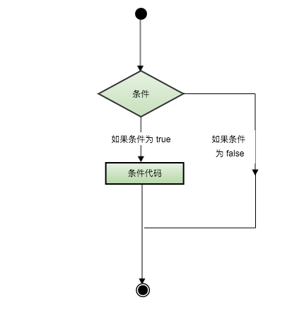

控制结构的条件表达式结果可以是任何值，Lua认为false和nil为假，true 和非nil为真。要注意的是Lua中 0 为 true：

```lua
--[ 0 为true ]
if(0)
then
    print("0 为真")
end
```

### if  语句:

```lua
if(布尔表达式)
then
   --[ 在布尔表达式为 true 时执行的语句 --]
end
```

### if...else 语句:

```lua
if(布尔表达式)
then
   --[ 布尔表达式为 true 时执行该语句块 --]
else
   --[ 布尔表达式为 false 时执行该语句块 --]
end
```

### if...else if...else 语句:

```lua
if( 布尔表达式 1)
then
   --[ 在布尔表达式 1 为 true 时执行该语句块 --]
else if( 布尔表达式 2)
   --[ 在布尔表达式 2 为 true 时执行该语句块 --]
else if( 布尔表达式 3)
   --[ 在布尔表达式 3 为 true 时执行该语句块 --]
else 
   --[ 如果以上布尔表达式都不为 true 则执行该语句块 --]
end
```

### Lua if 嵌套语句语法格式如下：

```lua
if( 布尔表达式 1)
then
   --[ 布尔表达式 1 为 true 时执行该语句块 --]
   if(布尔表达式 2)
   then
      --[ 布尔表达式 2 为 true 时执行该语句块 --]
   end
end
```

<hr>

## 六、Lua 函数：

### 函数定义

Lua 编程语言函数定义格式如下：

```lua
optional_function_scope function function_name( argument1, argument2, argument3..., argumentn)
   function_body
 return result_params_comma_separated
end
```

解析：

- **optional_function_scope**：

  该参数是可选的制定函数是全局函数还是局部函数？

- 未设置该参数默认为全局函数，如果你需要设置函数为局部函数需要使用关键字 local

- **function_name:**
- 指定函数名称。

- **argument1, argument2, argument3..., argumentn:**
- 函数参数，多个参数以逗号隔开，函数也可以不带参数。

- **function_body:**
- 函数体，函数中需要执行的代码语句块。

- **result_params_comma_separated:**
- 函数返回值，Lua语言函数可以返回多个值，每个值以逗号隔开。

```lua
--[[ 函数返回两个值的最大值 --]]
function max(num1, num2)

   if (num1 > num2) then
      result = num1;
   else
      result = num2;
   end

   return result; 
end
-- 调用函数
print("两值比较最大值为 ",max(10,4))
print("两值比较最大值为 ",max(5,6))
```

### 多返回值:

Lua函数可以返回多个结果值，比如string.find，其返回匹配串"开始和结束的下标"（如果不存在匹配串返回nil）。

```lua
function maximum (a)
    local mi = 1             -- 最大值索引
    local m = a[mi]          -- 最大值
    for i,val in ipairs(a) do
       if val > m then
           mi = i
           m = val
       end
    end
    return m, mi
end

print(maximum({8,10,23,12,5}))
```

### 可变参数:

Lua函数可以接受可变数目的参数，和C语言类似在函数参数列表中使用三点（...) 表示函数有可变的参数。

Lua将函数的参数放在一个叫arg的表中，**#arg** 表示传入参数的个数。

```lua
function average(...)
   result = 0
   local arg={...}
   for i,v in ipairs(arg) do
      result = result + v
   end
   print("总共传入 " .. #arg .. " 个数")
   return result/#arg
end

print("平均值为",average(10,5,3,4,5,6))
```

<hr/>

## 七、Lua 运算符：

Lua提供了以下几种运算符类型：

- 算术运算符

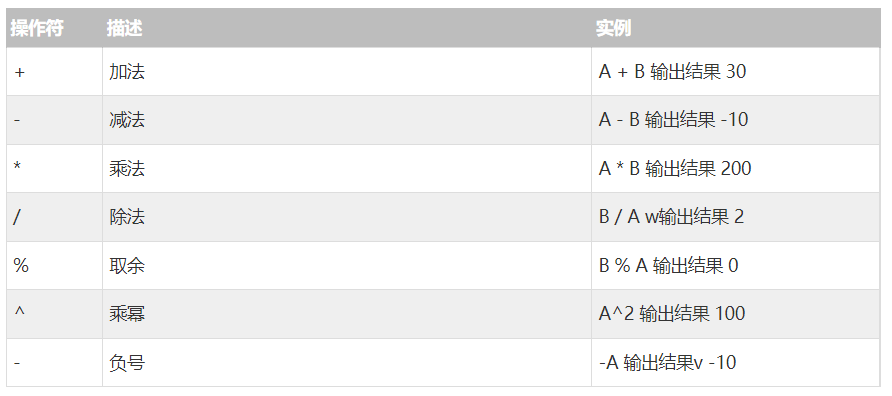

- 关系运算符

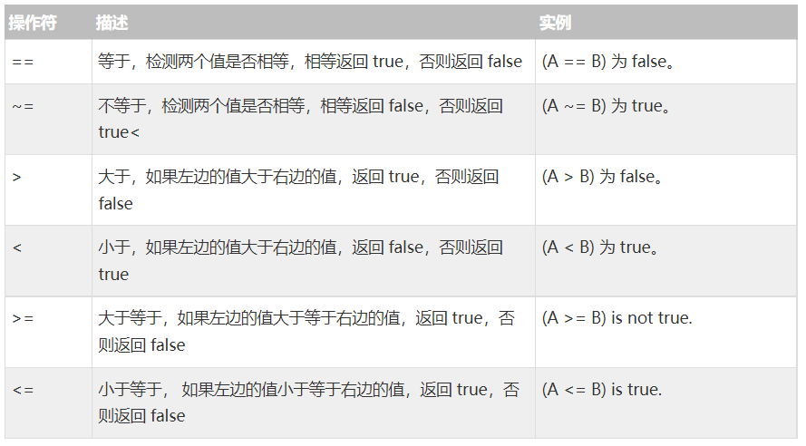

- 逻辑运算符

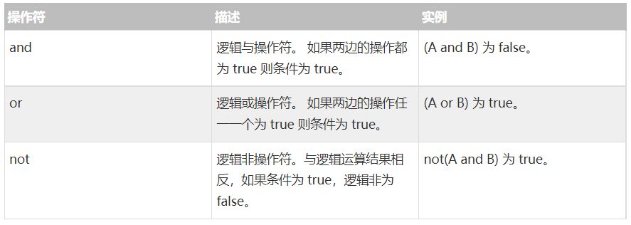

- 其他运算符

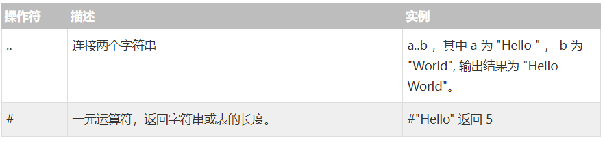

<hr>

## 八、Lua 字符串：

Lua 语言中字符串可以使用以下三种方式来表示：

- 单引号间的一串字符。
- 双引号间的一串字符。
- [[和]]间的一串字符。

### 转义字符：

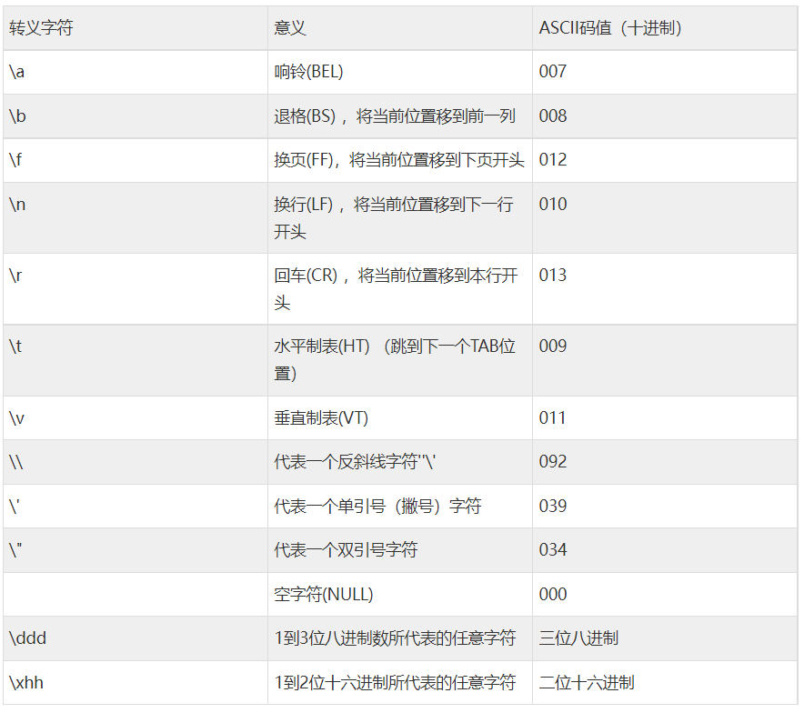

### 字符串操作：

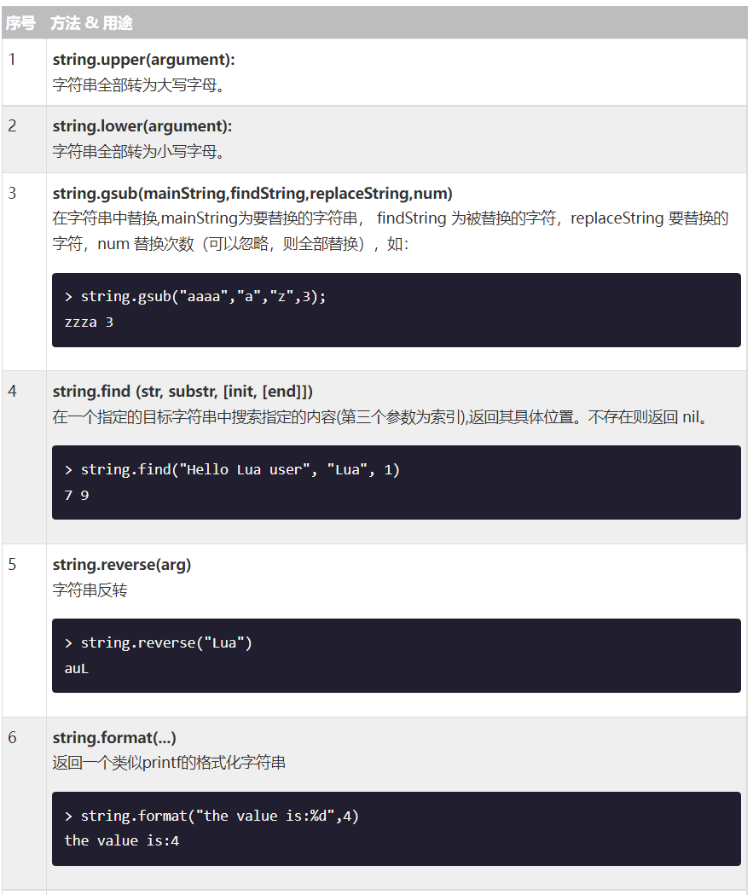

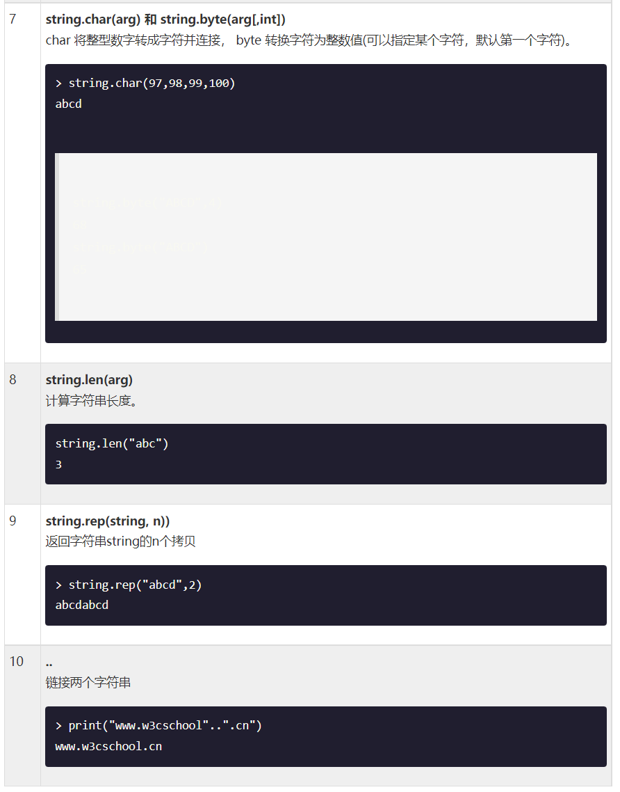