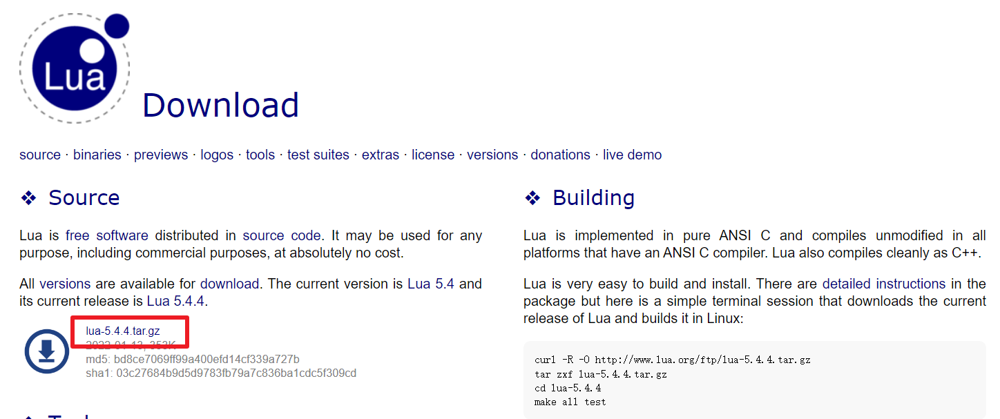
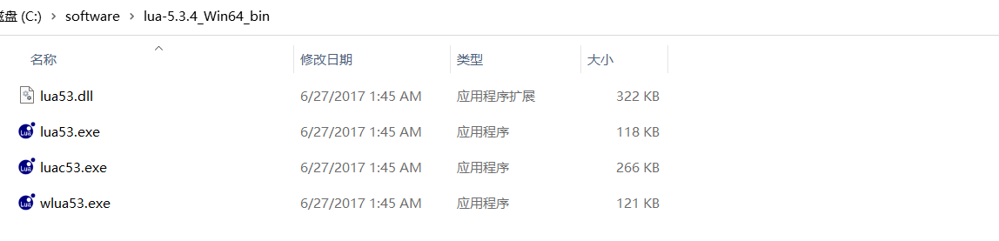
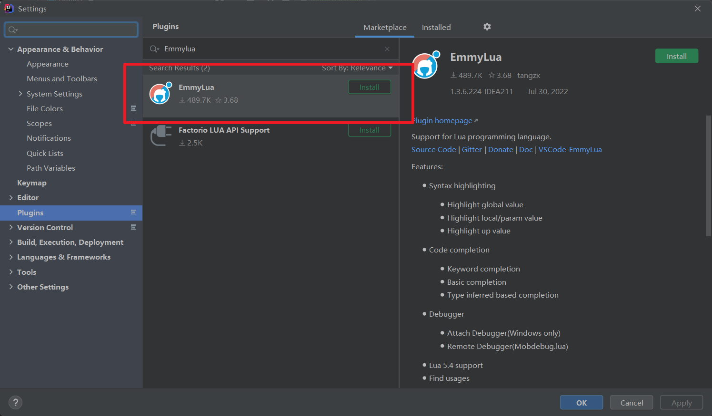
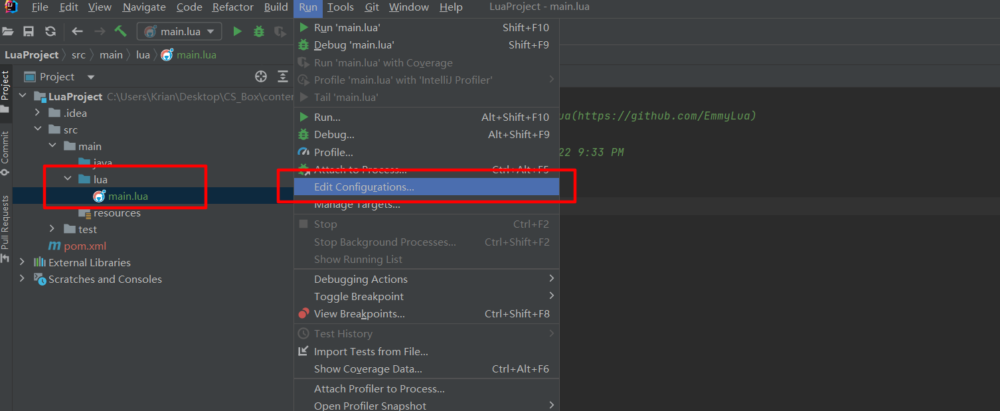
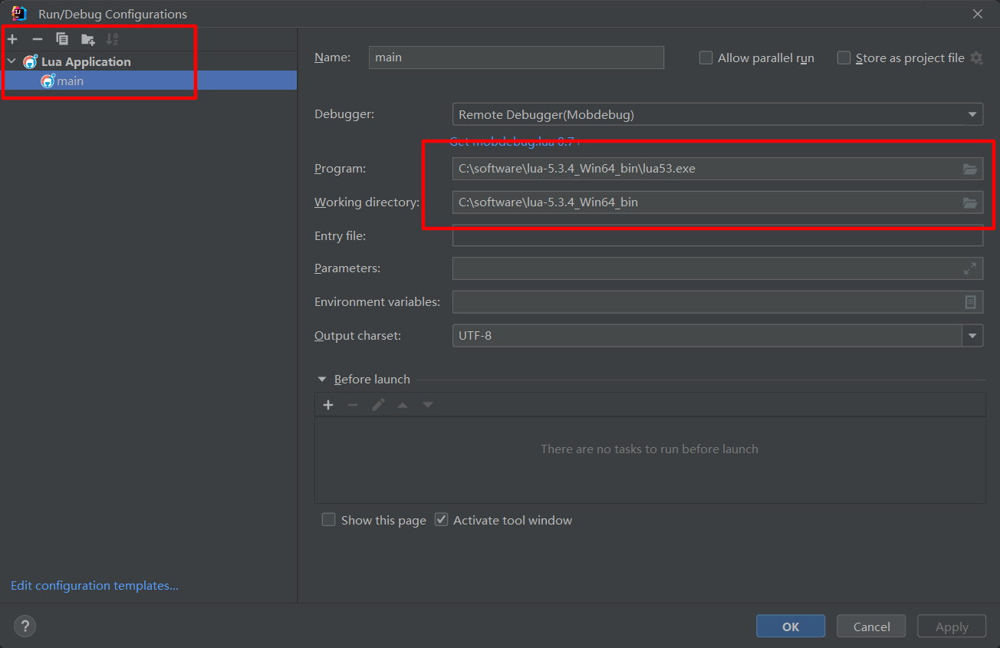
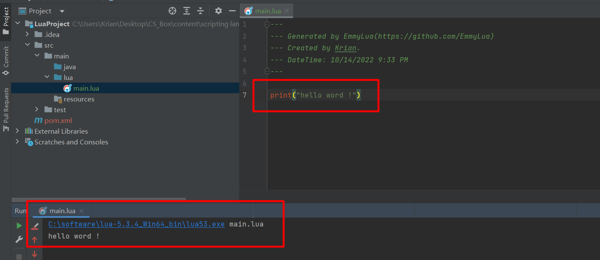
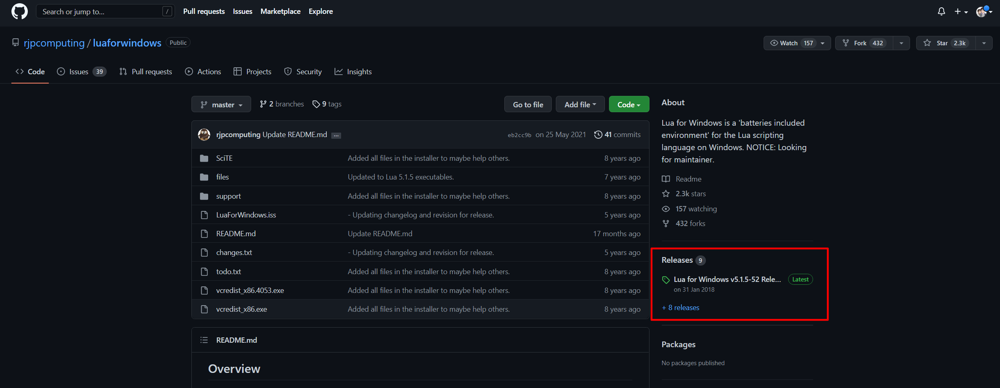

# Lua 开发环境配置

<b>官网链接：[http://www.lua.org/](http://www.lua.org/) </b>

### 使用IDEA（JetBrains公司所有的IDE）配置插件搭建 Lua 开发环境

1. 下载 Lua SDK：

[Lua SDK 下载地址](https://sourceforge.net/projects/luabinaries/files/5.3.4/Tools%20Executables/lua-5.3.4_Win64_bin.zip)

下面是官方提供的源码下载地址，可以自行编译：

下载完成之后，在windows中某个目录解压:

2. 进入IDEA（JetBrains公司所有的IDE）中，下载安装 Lua插件: Emmylua,安装后重启idea：

3. 配置编译器位置。在创建的工程中，创建一个Lua文件源目录，编写Lua脚本，配置解释器位置：

配置Lua 解释器的地址（注意是 luaXXX.exe !!!）：

4. 解释执行程序：

### 使用 Windows安装包方法安装：

[Lua 解释器 GitHub地址](https://github.com/rjpcomputing/luaforwindows)

进入Releases 中下载 exe 执行文件（Lua 解释器安装包），双击下一步安装！

