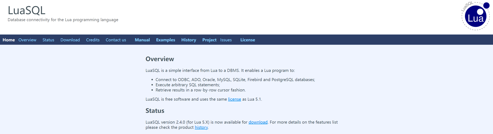
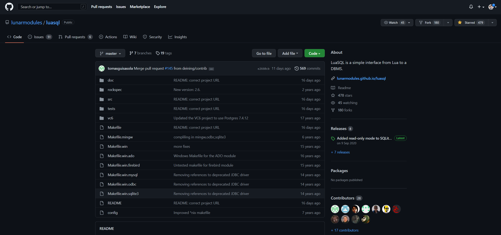
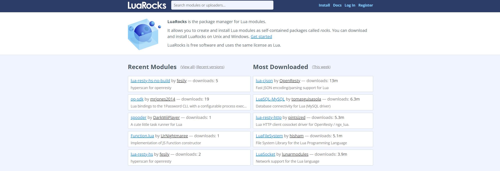

# Lua 操作数据库：

[💨💨 LuaSQL 官方地址](https://lunarmodules.github.io/luasql/)



**LuaSQL 是从Lua到DBMS的简单接口。** 它可以：

- 连接ODBC、ADO、Oracle、MySQL、SQLite、Firebird和PostgreSQL数据库；
- 执行任意SQL语句；
- 以逐行光标方式检索结果；

[💨💨 LuaSQL GitHub地址](https://github.com/lunarmodules/luasql)



<hr/>

## LuaSQL 安装：

可以通过[LuaRocks](https://luarocks.org/)使用所选数据库的驱动程序安装LuaSQL：

```text
luarocks install luasql-sqlite3
luarocks install luasql-postgres
luarocks install luasql-mysql
luarocks install luasql-sqlite
luarocks install luasql-odbc
```

### LuaRocks:

[LuaRocks 官方地址](https://luarocks.org/)



[LuaRocks GitHub 地址](https://github.com/luarocks/luarocks)


[Windows 环境安装 LuaRocks](https://github.com/luarocks/luarocks/wiki/Installation-instructions-for-Windows)

